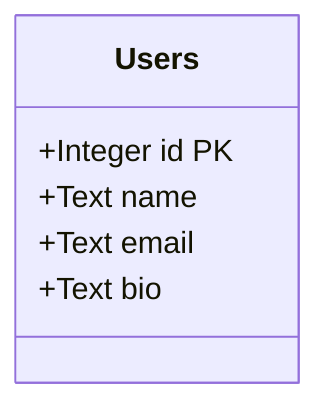
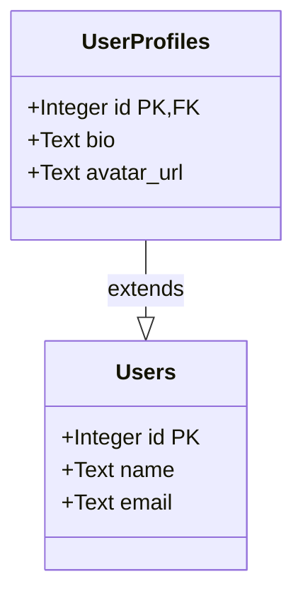
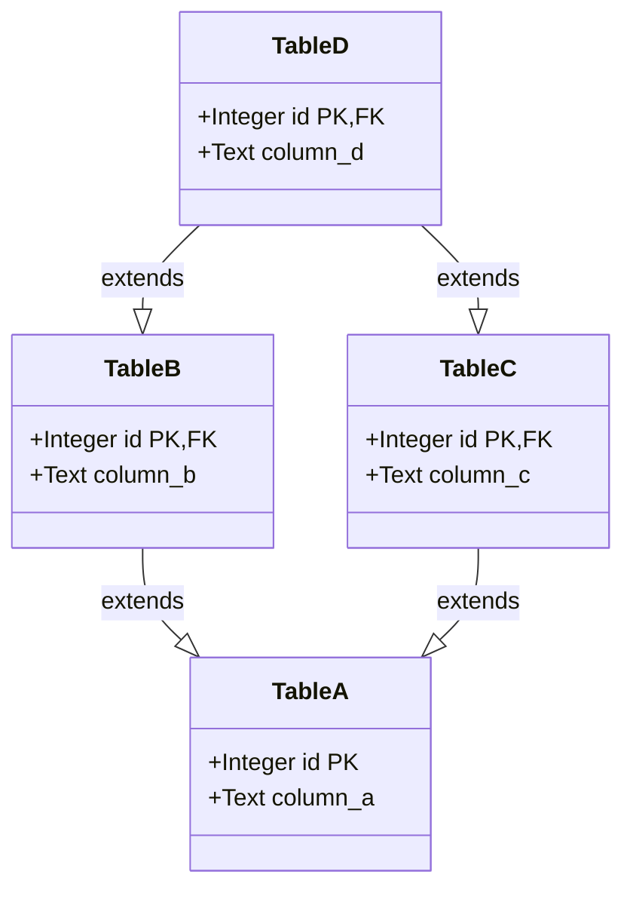
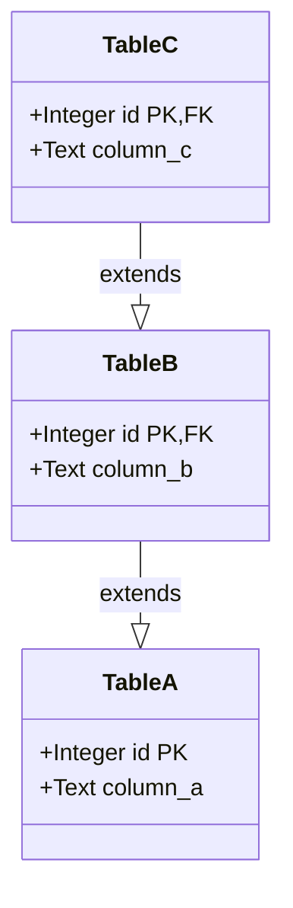
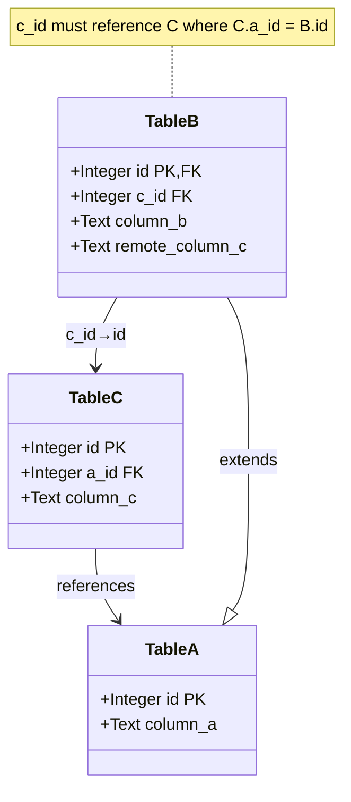
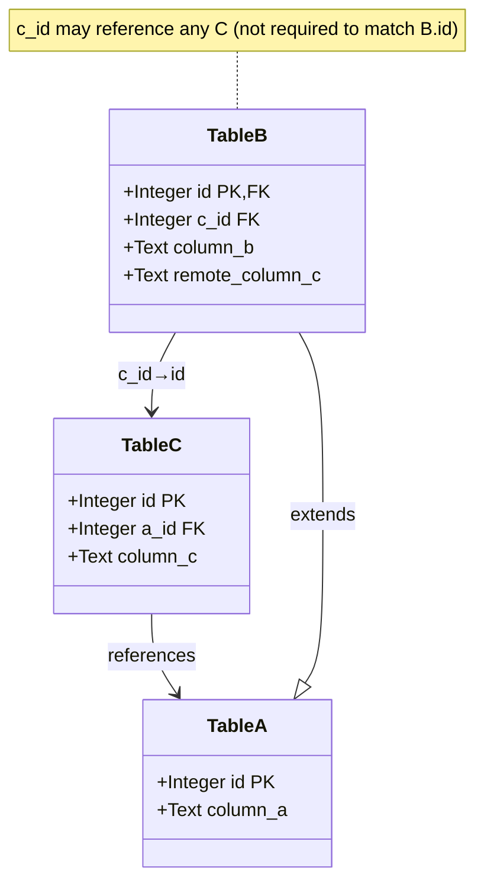
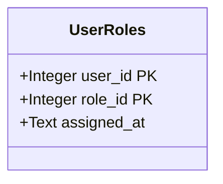

# Diesel Builders

[](https://docs.rs/diesel-builders)
[](https://github.com/LucaCappelletti94/diesel-builders/actions)
[](https://github.com/LucaCappelletti94/diesel-builders/actions)
[](https://codecov.io/gh/LucaCappelletti94)
[](https://opensource.org/licenses/MIT)
[](https://crates.io/crates/diesel-builders)

A type-safe builder pattern library for [Diesel](https://diesel.rs) that handles complex table relationships including arbitrary inheritance (including DAG dependencies), foreign keys, and both mandatory and optional triangular dependencies. Diesel Builders provides compile-time guarantees for proper insertion order and referential integrity in databases with complex schemas.

It additionally offers ergonomic APIs for getting/setting column values and associated builders and models.

## Installation

Add this to your `Cargo.toml`:

```toml
[dependencies]
diesel-builders = "0.1"
```

## Supported Patterns

### 1. Simple Table (Base Case)

A single table with no relationships:



```rust
use diesel_builders::prelude::*;

diesel::table! {
    users (id) {
        id -> Integer,
        name -> Text,
        email -> Text,
        bio -> Nullable<Text>,
    }
}

#[derive(Debug, Queryable, Clone, Selectable, Identifiable, GetColumn, Root, TableModel)]
#[diesel(table_name = users)]
pub struct User {
    pub id: i32,
    pub name: String,
    pub email: String,
    pub bio: Option<String>,
}

#[derive(Debug, Default, Clone, Insertable, MayGetColumn, SetColumn, HasTable)]
#[diesel(table_name = users)]
pub struct NewUser {
    pub name: Option<String>,
    pub email: Option<String>,
    pub bio: Option<Option<String>>,
}

impl TableAddition for users::table {
    type InsertableModel = NewUser;
    type Model = User;
    type InsertableColumns = (users::name, users::email, users::bio);
}

fn main() -> Result<(), Box<dyn std::error::Error>> {
    let mut conn = SqliteConnection::establish(":memory:")?;
    
    // Create the table
    diesel::sql_query(
        "CREATE TABLE users (
            id INTEGER PRIMARY KEY NOT NULL,
            name TEXT NOT NULL,
            email TEXT NOT NULL,
            bio TEXT
        )"
    ).execute(&mut conn)?;
    
    // Use the builder to insert a user
    let user: User = users::table::builder()
        .try_set_column::<users::name>(&"Alice".to_string())?
        .try_set_column::<users::email>(&"alice@example.com".to_string())?
        .insert(&mut conn)?;
    
    assert_eq!(user.name, "Alice");
    assert_eq!(user.email, "alice@example.com");
    assert_eq!(user.bio, None); // bio not set, defaults to NULL
    Ok(())
}
```

### 2. Table Inheritance

Tables extending a parent table via foreign key on the primary key:



```rust
// Complete working example with table inheritance
use diesel_builders::prelude::*;

diesel::table! { users (id) { id -> Integer, name -> Text, email -> Text, } }
diesel::table! { user_profiles (id) { id -> Integer, bio -> Text, avatar_url -> Text, } }
diesel::joinable!(user_profiles -> users (id));
diesel::allow_tables_to_appear_in_same_query!(users, user_profiles);

#[derive(Debug, Queryable, Clone, Selectable, Identifiable, GetColumn, Root, TableModel)]
#[diesel(table_name = users)]
pub struct User { pub id: i32, pub name: String, pub email: String, }

#[derive(Debug, Default, Clone, Insertable, MayGetColumn, SetColumn, HasTable)]
#[diesel(table_name = users)]
pub struct NewUser { pub name: Option<String>, pub email: Option<String>, }

impl TableAddition for users::table {
    type InsertableModel = NewUser;
    type Model = User;
    type InsertableColumns = (users::name, users::email);
}

#[derive(Debug, Queryable, Clone, Selectable, Identifiable, GetColumn, TableModel, NoHorizontalSameAsGroup)]
#[diesel(table_name = user_profiles)]
pub struct UserProfile { pub id: i32, pub bio: String, pub avatar_url: String, }

#[descendant_of]
impl Descendant for user_profiles::table {
    type Ancestors = (users::table,);
    type Root = users::table;
}

#[derive(Debug, Default, Clone, Insertable, MayGetColumn, SetColumn, HasTable)]
#[diesel(table_name = user_profiles)]
pub struct NewUserProfile { pub id: Option<i32>, pub bio: Option<String>, pub avatar_url: Option<String>, }

impl TableAddition for user_profiles::table {
    type InsertableModel = NewUserProfile;
    type Model = UserProfile;
    type InsertableColumns = (user_profiles::bio, user_profiles::avatar_url);
}

impl BundlableTable for user_profiles::table {
    type MandatoryTriangularSameAsColumns = ();
    type DiscretionaryTriangularSameAsColumns = ();
}

fn main() -> Result<(), Box<dyn std::error::Error>> {
    let mut conn = SqliteConnection::establish(":memory:")?;
    
    // Create tables
    diesel::sql_query(
        "CREATE TABLE users (
            id INTEGER PRIMARY KEY NOT NULL,
            name TEXT NOT NULL,
            email TEXT NOT NULL
        )"
    ).execute(&mut conn)?;
    
    diesel::sql_query(
        "CREATE TABLE user_profiles (
            id INTEGER PRIMARY KEY NOT NULL REFERENCES users(id),
            bio TEXT NOT NULL,
            avatar_url TEXT NOT NULL
        )"
    ).execute(&mut conn)?;
    
    // Build and insert a profile (which also creates the parent user)
    let profile = user_profiles::table::builder()
        .set_column::<users::name>(&"Bob".to_string())
        .set_column::<users::email>(&"bob@example.com".to_string())
        .try_set_column::<user_profiles::bio>(&"Bio text".to_string())?
        .try_set_column::<user_profiles::avatar_url>(&"https://example.com/avatar.jpg".to_string())?
        .insert(&mut conn)?;
    
    assert_eq!(profile.bio, "Bio text");
    assert_eq!(profile.avatar_url, "https://example.com/avatar.jpg");
    Ok(())
}
```

### 3. Directed Acyclic Graph (DAG)

Multiple inheritance where a child table extends multiple parent tables:



The builder ensures proper insertion order: A → B, C → D.

### 4. Inheritance Chain

Linear inheritance where tables form a chain:



Insertion order is automatically determined: A → B → C.

### 5. Mandatory Triangular Relation

A triangular foreign key relationship where values must be consistent:



The builder enforces that `B.c_id == C.a_id == A.id`:

```rust
// Mandatory triangular relation - complete working example
use diesel_builders::prelude::*;

// Define tables
diesel::table! {
    table_a (id) { id -> Integer, column_a -> Text, }
}
diesel::table! {
    table_c (id) { id -> Integer, a_id -> Integer, column_c -> Text, }
}
diesel::table! {
    table_b (id) { id -> Integer, c_id -> Integer, column_b -> Text, remote_column_c -> Text, }
}

diesel::joinable!(table_c -> table_a (a_id));
diesel::joinable!(table_b -> table_c (id));
diesel::joinable!(table_b -> table_a (c_id));
diesel::allow_tables_to_appear_in_same_query!(table_a, table_b, table_c);

// Models for table A
#[derive(Debug, Queryable, Clone, Selectable, Identifiable, GetColumn, Root, TableModel)]
#[diesel(table_name = table_a)]
pub struct TableA { pub id: i32, pub column_a: String, }

#[derive(Debug, Default, Clone, Insertable, MayGetColumn, SetColumn, HasTable)]
#[diesel(table_name = table_a)]
pub struct NewTableA { pub column_a: Option<String>, }

impl TableAddition for table_a::table {
    type InsertableModel = NewTableA;
    type Model = TableA;
    type InsertableColumns = (table_a::column_a,);
}

// Models for table C
#[derive(Debug, Queryable, Clone, Selectable, Identifiable, GetColumn, Root, TableModel)]
#[diesel(table_name = table_c)]
pub struct TableC { pub id: i32, pub a_id: i32, pub column_c: String, }

#[derive(Debug, Default, Clone, Insertable, MayGetColumn, SetColumn, HasTable)]
#[diesel(table_name = table_c)]
pub struct NewTableC { pub a_id: Option<i32>, pub column_c: Option<String>, }

impl TableAddition for table_c::table {
    type InsertableModel = NewTableC;
    type Model = TableC;
    type InsertableColumns = (table_c::a_id, table_c::column_c);
}

// Models for table B
#[derive(Debug, Queryable, Clone, Selectable, Identifiable, GetColumn, TableModel)]
#[diesel(table_name = table_b)]
pub struct TableB { pub id: i32, pub c_id: i32, pub column_b: String, pub remote_column_c: String, }

#[descendant_of]
impl Descendant for table_b::table {
    type Ancestors = (table_a::table,);
    type Root = table_a::table;
}

#[derive(Debug, Default, Clone, Insertable, MayGetColumn, SetColumn, HasTable)]
#[diesel(table_name = table_b)]
pub struct NewTableB { pub id: Option<i32>, pub c_id: Option<i32>, pub column_b: Option<String>, pub remote_column_c: Option<String>, }

impl TableAddition for table_b::table {
    type InsertableModel = NewTableB;
    type Model = TableB;
    type InsertableColumns = (table_b::id, table_b::c_id, table_b::column_b, table_b::remote_column_c);
}

impl diesel_builders::SingletonForeignKey for table_b::c_id {
    type ReferencedTable = table_c::table;
}

impl diesel_builders::HorizontalSameAsKey for table_b::c_id {
    type HostColumns = (table_b::id, table_b::remote_column_c);
    type ForeignColumns = (table_c::a_id, table_c::column_c);
}

#[diesel_builders_macros::bundlable_table]
impl BundlableTable for table_b::table {
    type MandatoryTriangularSameAsColumns = (table_b::c_id,);
    type DiscretionaryTriangularSameAsColumns = ();
}

fn main() -> Result<(), Box<dyn std::error::Error>> {
    let mut conn = SqliteConnection::establish(":memory:")?;
    
    // Create tables with constraints
    diesel::sql_query(
        "CREATE TABLE table_a (
            id INTEGER PRIMARY KEY NOT NULL,
            column_a TEXT NOT NULL
        )"
    ).execute(&mut conn)?;
    
    diesel::sql_query(
        "CREATE TABLE table_c (
            id INTEGER PRIMARY KEY NOT NULL,
            a_id INTEGER NOT NULL REFERENCES table_a(id),
            column_c TEXT NOT NULL,
            UNIQUE(id, a_id),
            UNIQUE(id, column_c)
        )"
    ).execute(&mut conn)?;
    
    diesel::sql_query(
        "CREATE TABLE table_b (
            id INTEGER PRIMARY KEY NOT NULL REFERENCES table_a(id),
            c_id INTEGER NOT NULL REFERENCES table_c(id),
            column_b TEXT NOT NULL,
            remote_column_c TEXT NOT NULL,
            FOREIGN KEY (c_id, id) REFERENCES table_c(id, a_id),
            FOREIGN KEY (c_id, remote_column_c) REFERENCES table_c(id, column_c)
        )"
    ).execute(&mut conn)?;
    
    // First insert a record in table A
    let a = table_a::table::builder()
        .set_column::<table_a::column_a>(&"Value A".to_string())
        .insert(&mut conn)?;
    
    // Create builder for table C
    let mut c_builder = table_c::table::builder();
    c_builder
        .set_column::<table_c::a_id>(&a.id)
        .set_column::<table_c::column_c>(&"Value C".to_string());
    
    // Insert into table B with mandatory triangular relation
    let b: TableB = table_b::table::builder()
        .set_column::<table_a::column_a>(&"Value A for B".to_string())
        .set_column::<table_b::column_b>(&"Value B".to_string())
        .set_mandatory_builder::<table_b::c_id>(c_builder)
        .insert(&mut conn)?;
    
    assert_eq!(b.column_b, "Value B");
    assert_eq!(b.remote_column_c, "Value C");
    Ok(())
}
```

### 6. Discretionary Triangular Relation

Similar to mandatory, but the relationship is optional:



```rust
// Discretionary triangular relation - complete working example
use diesel_builders::prelude::*;

// Define tables (same structure as mandatory, but relationship is optional)
diesel::table! {
    table_a (id) { id -> Integer, column_a -> Text, }
}
diesel::table! {
    table_c (id) { id -> Integer, a_id -> Integer, column_c -> Text, }
}
diesel::table! {
    table_b (id) { id -> Integer, c_id -> Integer, column_b -> Text, remote_column_c -> Text, }
}

diesel::joinable!(table_c -> table_a (a_id));
diesel::joinable!(table_b -> table_c (id));
diesel::joinable!(table_b -> table_a (c_id));
diesel::allow_tables_to_appear_in_same_query!(table_a, table_b, table_c);

// Models (same as mandatory example)
#[derive(Debug, Queryable, Clone, Selectable, Identifiable, GetColumn, Root, TableModel)]
#[diesel(table_name = table_a)]
pub struct TableA { pub id: i32, pub column_a: String, }

#[derive(Debug, Default, Clone, Insertable, MayGetColumn, SetColumn, HasTable)]
#[diesel(table_name = table_a)]
pub struct NewTableA { pub column_a: Option<String>, }

impl TableAddition for table_a::table { type InsertableModel = NewTableA; type Model = TableA; type InsertableColumns = (table_a::column_a,); }

#[derive(Debug, Queryable, Clone, Selectable, Identifiable, GetColumn, Root, TableModel)]
#[diesel(table_name = table_c)]
pub struct TableC { pub id: i32, pub a_id: i32, pub column_c: String, }

#[derive(Debug, Default, Clone, Insertable, MayGetColumn, SetColumn, HasTable)]
#[diesel(table_name = table_c)]
pub struct NewTableC { pub a_id: Option<i32>, pub column_c: Option<String>, }

impl TableAddition for table_c::table { type InsertableModel = NewTableC; type Model = TableC; type InsertableColumns = (table_c::a_id, table_c::column_c); }

#[derive(Debug, Queryable, Clone, Selectable, Identifiable, GetColumn, TableModel)]
#[diesel(table_name = table_b)]
pub struct TableB { pub id: i32, pub c_id: i32, pub column_b: String, pub remote_column_c: String, }

#[descendant_of]
impl Descendant for table_b::table { type Ancestors = (table_a::table,); type Root = table_a::table; }

#[derive(Debug, Default, Clone, Insertable, MayGetColumn, SetColumn, HasTable)]
#[diesel(table_name = table_b)]
pub struct NewTableB { pub id: Option<i32>, pub c_id: Option<i32>, pub column_b: Option<String>, pub remote_column_c: Option<String>, }

impl TableAddition for table_b::table { type InsertableModel = NewTableB; type Model = TableB; type InsertableColumns = (table_b::id, table_b::c_id, table_b::column_b, table_b::remote_column_c); }
impl diesel_builders::SingletonForeignKey for table_b::c_id { type ReferencedTable = table_c::table; }
impl diesel_builders::HorizontalSameAsKey for table_b::c_id { type HostColumns = (table_b::id, table_b::remote_column_c); type ForeignColumns = (table_c::a_id, table_c::column_c); }

#[diesel_builders_macros::bundlable_table]
impl BundlableTable for table_b::table {
    type MandatoryTriangularSameAsColumns = ();
    type DiscretionaryTriangularSameAsColumns = (table_b::c_id,);
}

fn main() -> Result<(), Box<dyn std::error::Error>> {
    let mut conn = SqliteConnection::establish(":memory:")?;
    
    // Create tables
    diesel::sql_query(
        "CREATE TABLE table_a (
            id INTEGER PRIMARY KEY NOT NULL,
            column_a TEXT NOT NULL
        )"
    ).execute(&mut conn)?;
    
    diesel::sql_query(
        "CREATE TABLE table_c (
            id INTEGER PRIMARY KEY NOT NULL,
            a_id INTEGER NOT NULL REFERENCES table_a(id),
            column_c TEXT NOT NULL,
            UNIQUE(id, column_c)
        )"
    ).execute(&mut conn)?;
    
    diesel::sql_query(
        "CREATE TABLE table_b (
            id INTEGER PRIMARY KEY NOT NULL REFERENCES table_a(id),
            c_id INTEGER NOT NULL REFERENCES table_c(id),
            column_b TEXT NOT NULL,
            remote_column_c TEXT NOT NULL,
            FOREIGN KEY (c_id, remote_column_c) REFERENCES table_c(id, column_c)
        )"
    ).execute(&mut conn)?;
    
    // Insert initial records
    let a = table_a::table::builder()
        .set_column::<table_a::column_a>(&"Value A".to_string())
        .insert(&mut conn)?;
    
    let c = table_c::table::builder()
        .set_column::<table_c::a_id>(&a.id)
        .set_column::<table_c::column_c>(&"Value C".to_string())
        .insert(&mut conn)?;
    
    // Option 1: With the optional relationship
    let mut c_builder = table_c::table::builder();
    c_builder
        .set_column::<table_c::a_id>(&a.id)
        .set_column::<table_c::column_c>(&"Value C for B".to_string());
    
    let triangular_b: TableB = table_b::table::builder()
        .set_column::<table_a::column_a>(&"Value A for B".to_string())
        .set_column::<table_b::column_b>(&"Value B".to_string())
        .set_discretionary_builder::<table_b::c_id>(c_builder)
        .insert(&mut conn)?;
    
    assert_eq!(triangular_b.column_b, "Value B");
    assert_eq!(triangular_b.remote_column_c, "Value C for B");
    
    // Option 2: Reference existing C record without triangular relationship
    let independent_b: TableB = table_b::table::builder()
        .set_column::<table_a::column_a>(&"Independent A for B".to_string())
        .set_column::<table_b::column_b>(&"Independent B".to_string())
        .set_discretionary_model::<table_b::c_id>(&c)
        .insert(&mut conn)?;
    
    assert_eq!(independent_b.column_b, "Independent B");
    assert_eq!(independent_b.remote_column_c, "Value C");
    Ok(())
}
```

### 7. Composite Primary Keys

Tables with multi-column primary keys:



```rust
use diesel_builders::prelude::*;

diesel::table! {
    user_roles (user_id, role_id) {
        user_id -> Integer,
        role_id -> Integer,
        assigned_at -> Text,
    }
}

#[derive(Debug, Queryable, Clone, Selectable, Identifiable, GetColumn, Root, TableModel)]
#[diesel(table_name = user_roles)]
#[diesel(primary_key(user_id, role_id))]
pub struct UserRole {
    pub user_id: i32,
    pub role_id: i32,
    pub assigned_at: String,
}

#[derive(Debug, Default, Clone, Insertable, MayGetColumn, SetColumn, HasTable)]
#[diesel(table_name = user_roles)]
pub struct NewUserRole {
    pub user_id: Option<i32>,
    pub role_id: Option<i32>,
    pub assigned_at: Option<String>,
}

impl TableAddition for user_roles::table {
    type InsertableModel = NewUserRole;
    type Model = UserRole;
    type InsertableColumns = (user_roles::user_id, user_roles::role_id, user_roles::assigned_at);
}

fn main() -> Result<(), Box<dyn std::error::Error>> {
    let mut conn = SqliteConnection::establish(":memory:")?;
    
    // Create table with composite primary key
    diesel::sql_query(
        "CREATE TABLE user_roles (
            user_id INTEGER NOT NULL,
            role_id INTEGER NOT NULL,
            assigned_at TEXT NOT NULL,
            PRIMARY KEY (user_id, role_id)
        )"
    ).execute(&mut conn)?;
    
    // Use builder to insert
    let user_role: UserRole = user_roles::table::builder()
        .try_set_column::<user_roles::user_id>(&1)?
        .try_set_column::<user_roles::role_id>(&10)?
        .try_set_column::<user_roles::assigned_at>(&"2025-01-01".to_string())?
        .insert(&mut conn)?;
    
    assert_eq!(user_role.user_id, 1);
    assert_eq!(user_role.role_id, 10);
    assert_eq!(user_role.assigned_at, "2025-01-01");
    Ok(())
}
```

## Usage Example

```rust
use diesel_builders::prelude::*;

// Define your table schema
diesel::table! {
    users (id) {
        id -> Integer,
        name -> Text,
        email -> Text,
        bio -> Nullable<Text>,
    }
}

// Define your models with derives
#[derive(Debug, Queryable, Clone, Selectable, Identifiable, GetColumn, Root, TableModel)]
#[diesel(table_name = users)]
pub struct User {
    pub id: i32,
    pub name: String,
    pub email: String,
    pub bio: Option<String>,
}

#[derive(Debug, Default, Clone, Insertable, MayGetColumn, SetColumn, HasTable)]
#[diesel(table_name = users)]
pub struct NewUser {
    pub name: Option<String>,
    pub email: Option<String>,
    pub bio: Option<Option<String>>,
}

impl TableAddition for users::table {
    type InsertableModel = NewUser;
    type Model = User;
    type InsertableColumns = (users::name, users::email, users::bio);
}

fn main() -> Result<(), Box<dyn std::error::Error>> {
    let mut conn = SqliteConnection::establish(":memory:")?;
    
    // Create the table
    diesel::sql_query(
        "CREATE TABLE users (
            id INTEGER PRIMARY KEY NOT NULL,
            name TEXT NOT NULL,
            email TEXT NOT NULL,
            bio TEXT
        )"
    ).execute(&mut conn)?;
    
    // Build and insert a user
    let user: User = users::table::builder()
        .try_set_column::<users::name>(&"Alice".to_string())?
        .try_set_column::<users::email>(&"alice@example.com".to_string())?
        .insert(&mut conn)?;
    
    assert_eq!(user.name, "Alice");
    assert_eq!(user.email, "alice@example.com");
    Ok(())
}
```

## Macro Attributes

- `#[derive(Root)]`: Marks a table as a root (no parent tables)
- `#[derive(TableModel)]`: Generates model-to-table associations
- `#[derive(GetColumn, SetColumn)]`: Generates type-safe column accessors
- `#[descendant_of]`: Declares parent table relationships
- `#[bundlable_table]`: Configures triangular relationship columns

## License

MIT

## Contributing

Contributions are welcome! Please feel free to submit a Pull Request.
