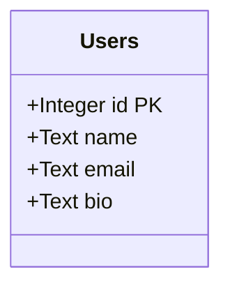
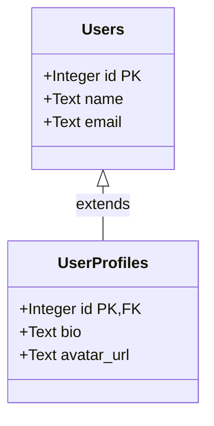
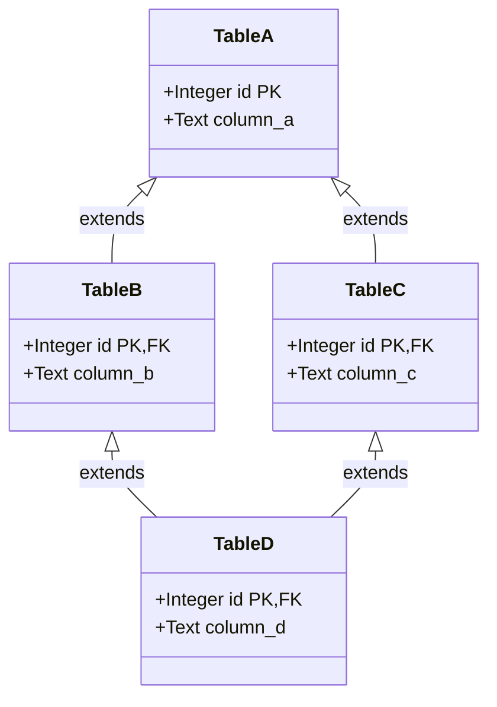
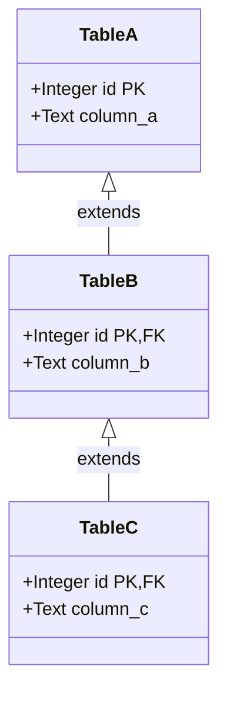
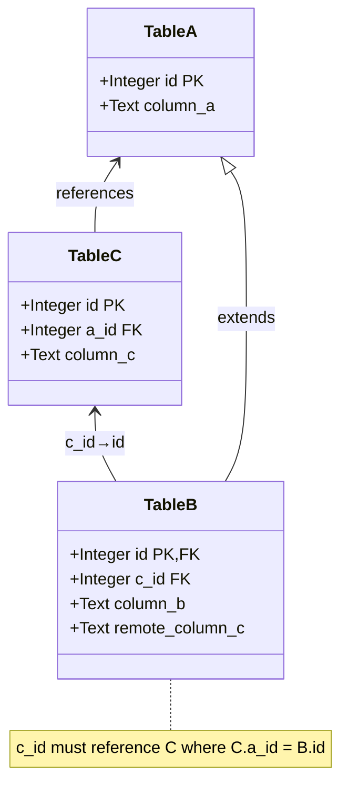
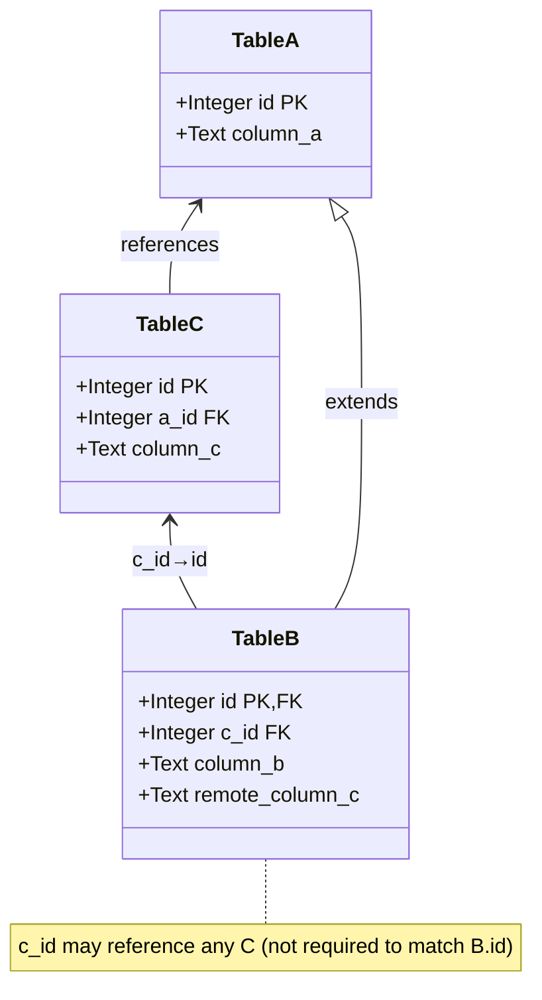
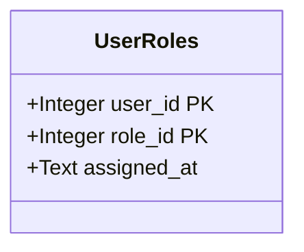

# Diesel Builders

[](https://github.com/LucaCappelletti94/diesel-builders/actions)
[](https://github.com/LucaCappelletti94/diesel-builders/actions)
[](https://codecov.io/gh/LucaCappelletti94)
[](https://opensource.org/licenses/MIT)

A type-safe builder pattern library for [Diesel](https://diesel.rs) that handles complex table relationships including arbitrary inheritance (including DAG dependencies), foreign keys, and both mandatory and optional triangular dependencies. Diesel Builders provides compile-time guarantees for proper insertion order and referential integrity in databases with complex schemas.

It additionally offers ergonomic APIs for getting/setting column values and associated builders and models.

## Installation

Add this to your `Cargo.toml`:

```toml
[dependencies]
diesel-builders = {git = "https://github.com/LucaCappelletti94/diesel-builders.git", branch = "main" }
```

## Supported Patterns

### 1. Simple Table (Base Case)

[A single table with no relationships](examples/simple_table.rs). This demonstrates the most basic usage of the builder pattern with type-safe column setters and optional validation through `TrySetColumn` trait implementations.



### 2. Table Inheritance

[Tables extending a parent table](examples/table_inheritance.rs) via foreign key on the primary key. When inserting into a child table, the builder automatically creates the parent record and ensures proper referential integrity. The `#[descendant_of]` macro declares the inheritance relationship. Insertion order: Users → UserProfiles.



### 3. Directed Acyclic Graph (DAG)

[Multiple inheritance](examples/dag.rs) where a child table extends multiple parent tables. Table D extends both B and C, which both extend A. The builder automatically resolves the dependency graph and inserts records in the correct order, ensuring all foreign key constraints are satisfied. Insertion order: A → B → C → D.



### 4. Inheritance Chain

[A linear inheritance chain](examples/inheritance_chain.rs) where each table extends exactly one parent. The builder automatically determines and enforces the correct insertion order through the dependency graph. Insertion order: A → B → C.



### 5. Mandatory Triangular Relation

[A complex pattern](diesel-builders/tests/test_mandatory_triangular_relation.rs) where Table B extends A and also references Table C, with the constraint that the C record must also reference the same A record (enforcing `B.c_id == C.a_id == A.id`). The builder uses `set_mandatory_builder` to create both B and its related C record atomically, ensuring referential consistency. Foreign key relationships are declared using the `fk!` macro for type-safe multi-column constraints, with composite indices declared via `index!` macro (e.g., `index!((table_c::id, table_c::a_id));`). Insertion order: A → C → B.



### 6. Discretionary Triangular Relation

[Similar to the mandatory triangular relation](diesel-builders/tests/test_discretionary_triangular_relation.rs), but the constraint is relaxed—Table B can reference any C record, not necessarily one that shares the same A parent. The builder provides `set_discretionary_builder` for creating new related records or `set_discretionary_model` for referencing existing ones. Foreign key relationships are declared using the `fk!` macro, with composite indices declared via `index!` macro where needed. Insertion order: A → C (independent) → B (where B references the independent C).



### 7. Composite Primary Keys

[Tables with multi-column primary keys](examples/composite_primary_keys.rs) are fully supported. The builder pattern works seamlessly with composite keys, allowing type-safe construction and insertion.



- `#[derive(Root)]`: Marks a table as a root (no parent tables)
- `#[derive(TableModel)]`: Generates model-to-table associations and automatically implements `IndexedColumn` for all primary key columns, making them available as foreign key targets
- `#[derive(GetColumn, SetColumn)]`: Generates type-safe column accessors
- `#[descendant_of]`: Declares parent table relationships
- `#[bundlable_table]`: Configures triangular relationship columns
- `fk!`: Declares foreign key relationships with SQL-like syntax (e.g., `fk!((table_b::c_id, table_b::id) REFERENCES (table_c::id, table_c::a_id))`)
- `index!`: Declares table indices (including composite indices) that can be used as foreign key targets (e.g., `index!((table_c::id, table_c::a_id));`). Primary keys (both single and composite) are automatically indexed by `TableModel` and don't need explicit `index!` declarations

## License

MIT

## Contributing

Contributions are welcome! Please feel free to submit a Pull Request.
