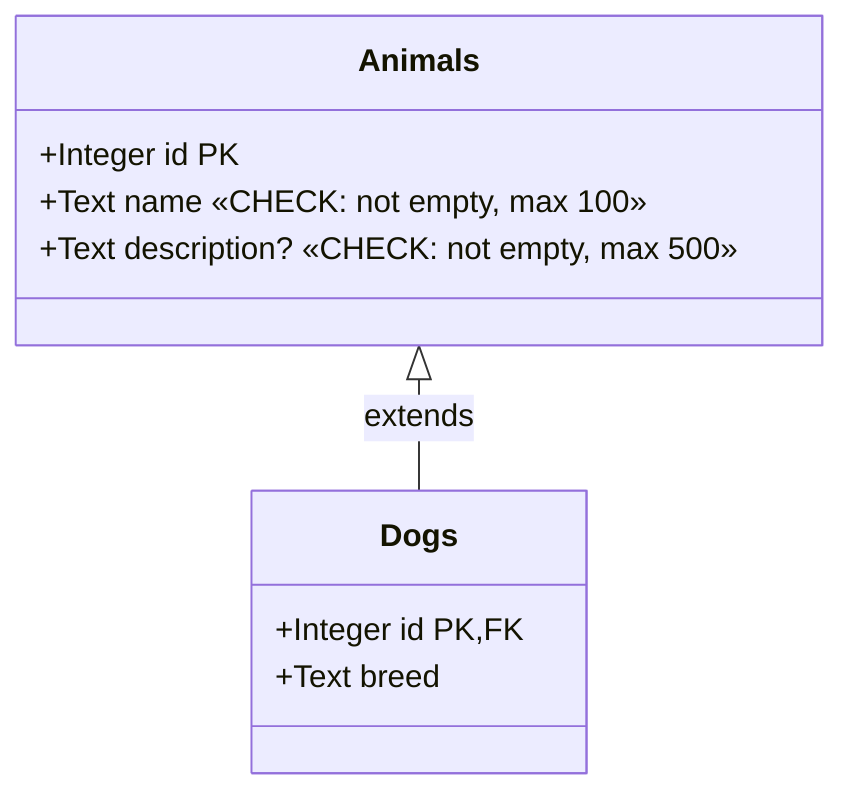
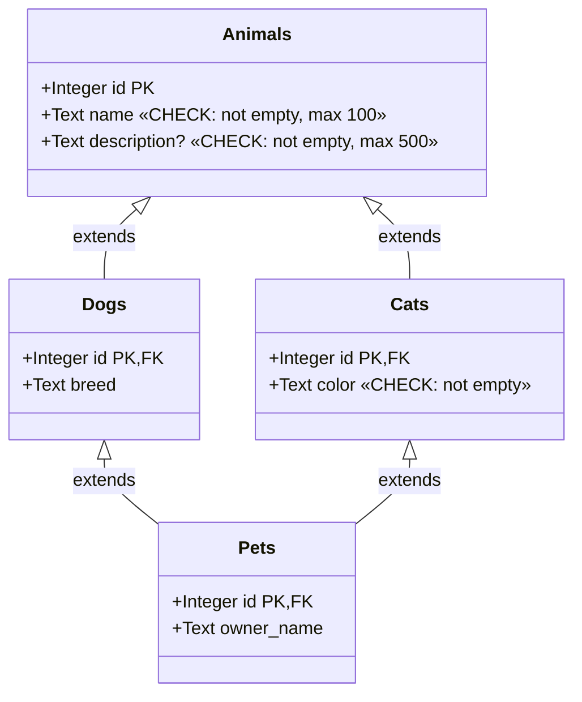
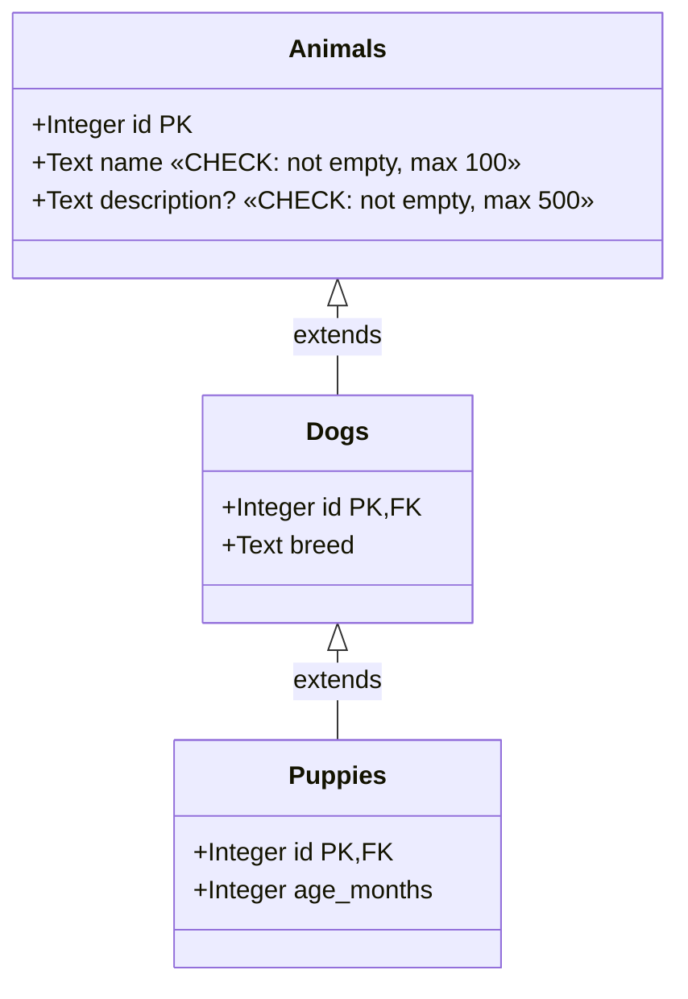
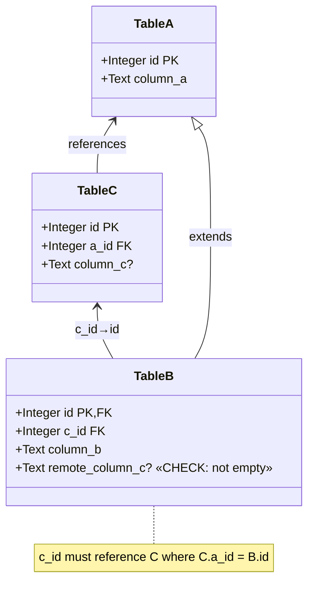
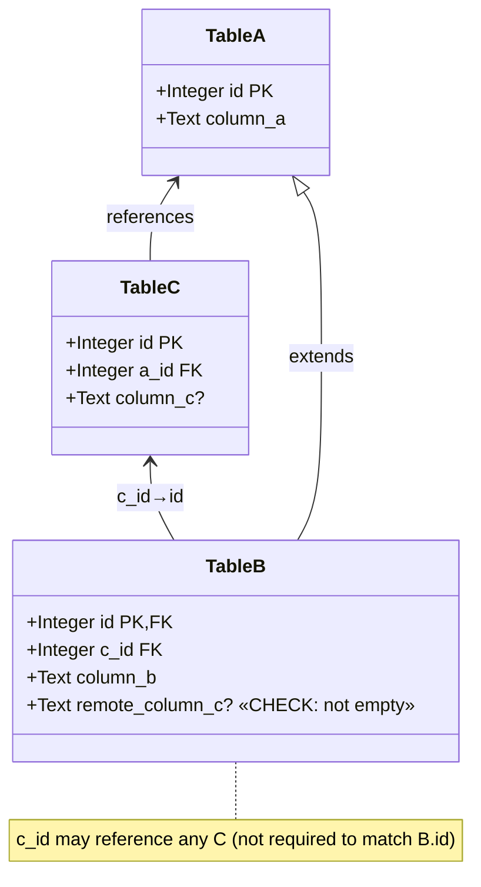
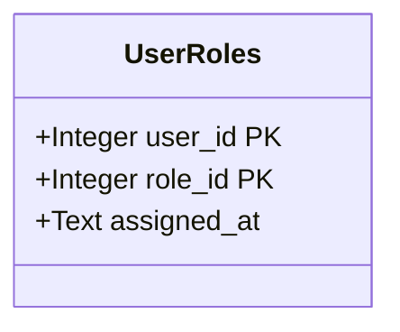

# Diesel Builders

[](https://github.com/LucaCappelletti94/diesel-builders/actions)
[](https://github.com/LucaCappelletti94/diesel-builders/actions)
[](https://codecov.io/gh/LucaCappelletti94)
[](https://opensource.org/licenses/MIT)

A type-safe builder pattern library for [Diesel](https://diesel.rs) that handles complex table relationships including arbitrary inheritance (e.g. chains, DAG dependencies), foreign keys, and both mandatory and optional triangular dependencies. Diesel Builders provides compile-time guarantees for proper insertion order and referential integrity in databases with complex schemas.

It additionally offers ergonomic APIs for getting/setting column values and associated builders and models, and [`serde`](https://github.com/serde-rs/serde) support.

This library is transparent in terms of backends and should work for any Diesel backend. In the README and tests, we use `SQLite` for simplicity.

## Installation

Add this to your `Cargo.toml`:

```toml
[dependencies]
diesel-builders = {git = "https://github.com/LucaCappelletti94/diesel-builders.git", branch = "main" }
```

## Supported Patterns

### 1. Simple Table (Base Case)

[A single table with no relationships](diesel-builders/tests/test_base_case.rs). This demonstrates the most basic usage of the builder pattern with type-safe column setters. Optional validation through `TrySetColumn` trait implementations enables Rust-side check constraints that mirror [SQL CHECK CONSTRAINT](https://www.postgresql.org/docs/current/ddl-constraints.html), providing fail-fast validation before database insertion.

```rust
use diesel_builders::prelude::*;

#[derive(Queryable, Selectable, Identifiable, TableModel)]
#[diesel(table_name = animals)]
#[table_model(surrogate_key)]
pub struct Animal {
    id: i32,
    name: String,
    description: Option<String>,
}

let mut conn = SqliteConnection::establish(":memory:")?;
diesel::sql_query(
    "CREATE TABLE animals (
        id INTEGER PRIMARY KEY,
        name TEXT NOT NULL,
        description TEXT
    );",
).execute(&mut conn)?;

let animal = animals::table::builder()
    .name("Buddy")
    .description("A friendly dog".to_owned())
    .insert(&mut conn)?;

Ok::<(), Box<dyn std::error::Error>>(())
```

### 2. Table Inheritance

[Tables extending a parent table](diesel-builders/tests/test_inheritance.rs) via foreign key on the primary key. When inserting into a child table, the builder automatically creates the parent record and ensures proper referential integrity. The `ancestors` attribute in `#[table_model]` declares the inheritance relationship. Insertion order: Animals → Dogs.



```rust,ignore
let dog = dogs::table::builder()
    .try_name("Max")?
    .breed("Golden Retriever")
    .insert(&mut conn)?;
```

### 3. Directed Acyclic Graph (DAG)

[Multiple inheritance](diesel-builders/tests/test_dag.rs) where a child table extends multiple parent tables. Pets extends both Dogs and Cats, which both extend Animals. The builder automatically resolves the dependency graph and inserts records in the correct order, ensuring all foreign key constraints are satisfied. Insertion order: Animals → Dogs → Cats → Pets.



```rust,ignore
let pet = pets::table::builder()
    .try_name("Buddy")?  
    .breed("Labrador")
    .try_color("Black")?
    .owner_name("Alice Smith")
    .insert(&mut conn)?;
```

### 4. Inheritance Chain

[A linear inheritance chain](diesel-builders/tests/test_inheritance_chain.rs) where each table extends exactly one parent. Puppies extends Dogs, which extends Animals. The builder automatically determines and enforces the correct insertion order through the dependency graph. Insertion order: Animals → Dogs → Puppies.



```rust,ignore
let puppy = puppies::table::builder()
    .try_name("Buddy")?
    .breed("Labrador")
    .age_months(3)
    .insert(&mut conn)?;
```

### 5. Mandatory Triangular Relation

[A complex pattern](diesel-builders/tests/test_mandatory_triangular_relation.rs) where Table B extends A and also references Table C, with the constraint that the C record must also reference the same A record (enforcing `B.c_id == C.a_id == A.id`). The builder uses `set_mandatory_builder` to create both B and its related C record atomically, ensuring referential consistency. Foreign key relationships are declared using the `fk!` macro for type-safe multi-column constraints, with composite indices declared via `index!` macro (e.g., `index!(table_c::id, table_c::a_id);`). Insertion order: A → C → B.



```rust,ignore
let b = table_b::table::builder()
    .column_a("Value A for B")
    .column_b("Value B")
    .c(table_c::table::builder().column_c("Value C".to_owned()))
    .insert(&mut conn)?;
```

### 6. Discretionary Triangular Relation

[Similar to the mandatory triangular relation](diesel-builders/tests/test_discretionary_triangular_relation.rs), but the constraint is relaxed. Table B can reference any C record, not necessarily one that shares the same A parent. The builder provides `set_discretionary_builder` for creating new related records or `set_discretionary_model` for referencing existing ones. Foreign key relationships are declared using the `fk!` macro, with composite indices declared via `index!` macro where needed. Insertion order: A → C (independent) → B (where B references the independent C).



```rust,ignore
let b = table_b::table::builder()
    .column_a("Value A for B")
    .column_b("Value B")
    .c(table_c::table::builder().column_c("Value C".to_owned()))
    .insert(&mut conn)?;
```

```rust,ignore
let c = table_c::table::builder()
    .a_id(a.id)
    .column_c("Value C".to_owned())
    .insert(&mut conn)?;

let b = table_b::table::builder()
    .column_a("Value A for B")
    .column_b("Value B")
    .c(&c)
    .insert(&mut conn)?;
```

### 7. Composite Primary Keys

[Tables with multi-column primary keys](examples/composite_primary_keys.rs) are fully supported. The builder pattern works seamlessly with composite keys, allowing type-safe construction and insertion.



## TableModel Derive Macro

The `#[derive(TableModel)]` macro is the primary code generation tool in diesel-builders. It automatically generates all the necessary trait implementations and helper methods for your table model.

### What TableModel Generates

For each field in your struct, `TableModel` generates:

1. **Core Column Traits:**
   - `Typed` - type information for the column
   - `GetColumn` - column value access from model instances
   - `IndexedColumn` - for primary key columns

2. **Builder Value Traits:**
   - `MayGetColumn` - optional column value access from builders
   - `TrySetColumn` - fallible column value setting
   - `SetColumnUnchecked` - unchecked column value setting

3. **Helper Method Traits:**
   For a column like `animals::name`, it generates:
   - **`GetAnimalsName`** - `name(&self)` returns `&Type`
   - **`SetAnimalsName`** - `name(self, value)` and `name_ref(&mut self, value)`
   - **`TrySetAnimalsName`** - `try_name(self, value)` and `try_name_ref(&mut self, value)`

4. **Table Relationship Traits:**
   - `Root` or `Descendant` - based on whether ancestors are specified
   - `BundlableTable` - for triangular relation support
   - `HorizontalSameAsGroup` - for managing same-as relationships

5. **Automatic Foreign Key (Single Ancestor):**
   When a table has a single ancestor and single-column primary key, `TableModel` automatically generates the equivalent of `fpk!(table::id -> ancestor)`, providing:
   - `ForeignPrimaryKey` implementation
   - Helper method to fetch the ancestor record (e.g., `id_fk()` or method named after ancestor)

### Attributes

- `#[table_model(error = ErrorType)]` - Specify a custom error type for validation
- `#[table_model(surrogate_key)]` - Mark the table as using a surrogate (auto-increment) primary key
- `#[table_model(ancestors = parent_table)]` - Declare table inheritance
- `#[table_model(ancestors(grandparent, parent))]` - Declare multiple inheritance
- `#[infallible]` - Mark a field as always valid (no validation needed)
- `#[mandatory]` - Mark a field as a mandatory triangular relation
- `#[discretionary]` - Mark a field as a discretionary triangular relation
- `#[table_model(default = value)]` - Provide a default value for the field

### Foreign Key Helper Traits

The `fpk!` (foreign primary key) macro generates helper traits for singleton foreign keys, providing convenient methods to fetch related records.

**Note:** For table inheritance (single ancestor with single-column primary key), `TableModel` automatically generates the `fpk!` implementation for the `id` column. You only need to manually use `fpk!` for other foreign key columns.

```rust,ignore
// Declare a singleton foreign key relationship
fpk!(table_b::c_id -> table_c);
```

This generates:

- `ForeignPrimaryKey` implementation for `table_b::c_id`
- A trait `FKTableBCId` with method `c(&self, conn: &mut Conn)` that fetches the related `TableC` record

**Method naming convention:**

- If column is `id`, the method is named after the foreign table (e.g., `table_c` → `table_c()`)
- If column ends with `_id` (e.g., `a_id`), the method is named after the prefix (`a()`)
- Otherwise, the method is `{column_name}_fk()`

Usage example:

```rust,ignore
fpk!(table_b::c_id -> table_c);

let b: TableB = /* ... */;
let c: TableC = b.c(&mut conn)?;  // Fetches the related TableC record
```

**Automatic generation for inheritance:**

```rust,ignore
// For a table with single ancestor, fpk! is auto-generated:
#[derive(TableModel)]
#[table_model(ancestors = animals)]
struct Dog { id: i32, /* ... */ }

// No need for: fpk!(dogs::id -> animals);
// The following is automatically available:
let dog: Dog = /* inserted dog */;
let animal: Animal = dog.id_fk(&mut conn)?; // Auto-generated method
```

### Triangular Relation Traits

For columns involved in triangular relations (both mandatory and discretionary), additional builder and model setter traits are generated:

- **Mandatory Builders**: `Set{Table}{Column}MandatoryBuilder` and `TrySet{Table}{Column}MandatoryBuilder`
  - `{column}_builder(self, builder) -> Self` - sets associated builder (consumes)
  - `{column}_builder_ref(&mut self, builder) -> &mut Self` - sets associated builder (by reference)
  - `try_{column}_builder(self, builder) -> Result<Self, Error>` - fallible variant

- **Discretionary Builders**: `Set{Table}{Column}DiscretionaryBuilder` and `TrySet{Table}{Column}DiscretionaryBuilder`
  - `{column}_builder(self, builder) -> Self` - sets associated builder (consumes)
  - `{column}_builder_ref(&mut self, builder) -> &mut Self` - sets associated builder (by reference)
  - `try_{column}_builder(self, builder) -> Result<Self, Error>` - fallible variant

- **Discretionary Models**: `Set{Table}{Column}DiscretionaryModel` and `TrySet{Table}{Column}DiscretionaryModel`
  - `{column}_model(self, &model) -> Self` - references existing model (consumes)
  - `{column}_model_ref(&mut self, &model) -> &mut Self` - references existing model (by reference)
  - `try_{column}_model(self, &model) -> Result<Self, Error>` - fallible variant

Usage examples:

```rust,ignore
// Basic column setter
let animal: Animal = animals::table::builder()
    .try_name("Buddy")?
    .insert(conn)?;

assert_eq!(animal.name(), "Buddy");

// Mandatory triangular relation with builder
let b = table_b::table::builder()
    .column_b("B Value")
    .try_c(table_c::table::builder().column_c("C Value".to_owned()))?
    .insert(conn)?;

// Discretionary triangular relation with existing model
let c = table_c::table::builder()
    .a_id(a.id)
    .column_c("C Value".to_owned())
    .insert(conn)?;

let b = table_b::table::builder()
    .column_b("B Value")
    .c(&c)  // Reference existing model
    .insert(conn)?;
```

## Default Values

Columns can have default values specified in the `TableModel` derive using the `#[table_model(default = value)]` attribute. These defaults are used when the user does not explicitly set a value for the column. The default values must implement `Into<ColumnType>`.

```rust,ignore
#[derive(TableModel)]
#[diesel(table_name = users)]
pub struct User {
    id: i32,
    #[table_model(default = "Guest")]
    pub name: String,
    #[table_model(default = true)]
    pub active: bool,
    pub email: String,
}

// "Guest" and true are used automatically
let user = users::table::builder()
    .email("user@example.com")
    .insert(&mut conn)?;
```

## Compile-time Validation

The `TableModel` derive macro performs extensive compile-time checks to ensure correctness:

- **Primary Keys**:
  - Default values are not allowed on primary key columns
  - Primary keys marked `#[infallible]` cannot be used with `surrogate_key`
  - Primary key must be detectable (either `id` field or explicit `#[diesel(primary_key(...))]`)
  
- **Surrogate Keys**:
  - Cannot be used with composite primary keys
  - Cannot have `#[mandatory]` or `#[discretionary]` attributes (surrogate keys cannot participate in triangular relations)
  
- **Ancestors**:
  - Table cannot be its own ancestor
  - No duplicate ancestors in hierarchy
  
- **Attribute Validation**:
  - Duplicate `#[mandatory]`, `#[discretionary]`, or `#[infallible]` attributes are rejected
  - Conflicting `#[mandatory]` and `#[discretionary]` on same field are rejected
  - Multiple `default` values are rejected
  - Unsupported `#[diesel(...)]` attributes trigger errors

## Macro Reference

### `TableModel` - Derive Macro

The primary macro for generating all table-related traits and implementations. See the [TableModel Derive Macro](#tablemodel-derive-macro) section for full details.

```rust,ignore
#[derive(TableModel)]
#[table_model(error = MyError, ancestors = parent_table)]
#[diesel(table_name = my_table)]
struct MyModel { /* ... */ }
```

### `fpk!` - Foreign Primary Key

Declares a singleton foreign key relationship (single column referencing a primary key).

**Note:** Automatically generated by `TableModel` for inheritance relationships (single ancestor, single-column primary key).

```rust,ignore
fpk!(table_b::c_id -> table_c);
```

Generates:

- `ForeignPrimaryKey` trait implementation
- Helper trait with method to fetch the related record

### `fk!` - Composite Foreign Key

Declares multi-column foreign key relationships:

```rust,ignore
fk!((table_b::c_id, table_b::remote_col) -> (table_c::id, table_c::col));
```

Generates `HostColumn` implementations for type-safe foreign key constraints.

### `index!` - Table Index

Declares composite indices that can be referenced by foreign keys:

```rust,ignore
index!(table_c::id, table_c::a_id);
```

Generates `IndexedColumn` implementations for each column in the index.

## License

MIT

## Contributing

Contributions are welcome! Please feel free to submit a Pull Request.
