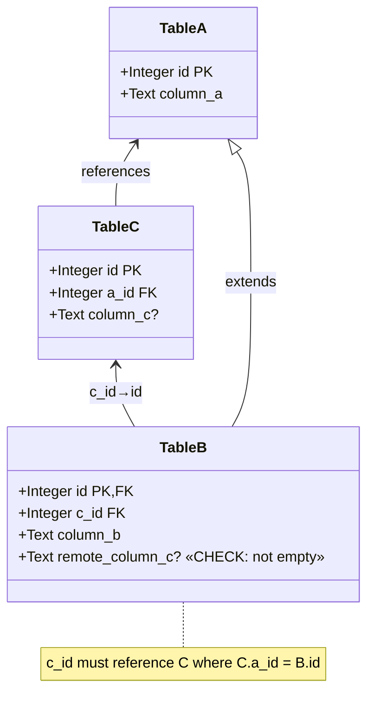
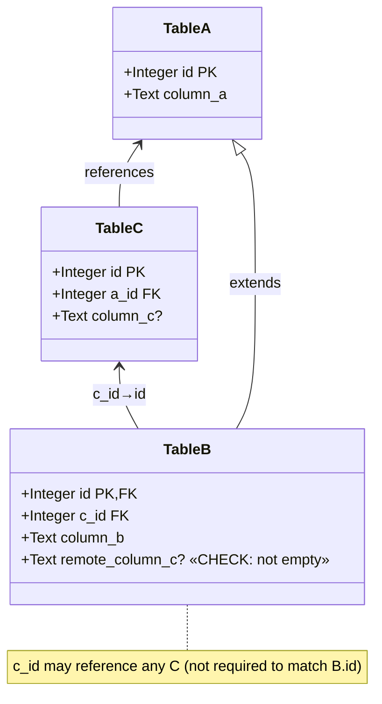

# Diesel Builders

[](https://github.com/LucaCappelletti94/diesel-builders/actions)
[](https://github.com/LucaCappelletti94/diesel-builders/actions)
[](https://codecov.io/gh/LucaCappelletti94)
[](https://opensource.org/licenses/MIT)

A type-safe builder pattern library for [Diesel](https://diesel.rs) that handles complex table relationships including arbitrary inheritance (e.g. chains, DAG dependencies), foreign keys, and both mandatory and optional triangular dependencies. Diesel Builders provides compile-time guarantees for proper insertion order and referential integrity in databases with complex schemas.

It additionally offers fluent APIs for getting/setting column values and associated builders and models, and [`serde`](https://github.com/serde-rs/serde) support.

This library is transparent in terms of backends and should work for any Diesel backend. In the README and tests, we use `SQLite` for simplicity.

## Installation

Add this to your `Cargo.toml`:

```toml
[dependencies]
diesel-builders = {git = "https://github.com/LucaCappelletti94/diesel-builders.git", branch = "main" }
```

## Supported Patterns

### 1. Simple Table (Base Case)

[A single table with no relationships](diesel-builders/tests/test_base_case.rs). This demonstrates the most basic usage of the builder pattern with type-safe column setters. Optional validation through `TrySetColumn` trait implementations enables Rust-side check constraints that mirror [SQL CHECK CONSTRAINT](https://www.postgresql.org/docs/current/ddl-constraints.html), providing fail-fast validation before database insertion.

```rust
use diesel_builders::prelude::*;

#[derive(Queryable, Selectable, Identifiable, TableModel)]
#[diesel(table_name = animals)]
#[table_model(surrogate_key)]
pub struct Animal {
    id: i32,
    name: String,
    description: Option<String>,
}

let mut conn = SqliteConnection::establish(":memory:")?;
diesel::sql_query(
    "CREATE TABLE animals (
        id INTEGER PRIMARY KEY,
        name TEXT NOT NULL,
        description TEXT
    );",
).execute(&mut conn)?;

let animal = animals::table::builder()
    .name("Buddy")
    .description("A friendly dog".to_owned())
    .insert(&mut conn)?;

Ok::<(), Box<dyn std::error::Error>>(())
```

### 2. Table Inheritance

[Tables extending a parent table](diesel-builders/tests/test_inheritance.rs) via foreign key on the primary key. When inserting into a child table, the builder automatically creates the parent record and ensures proper referential integrity. The `ancestors` attribute in `#[table_model]` declares the inheritance relationship.

```rust
use diesel_builders::prelude::*;

#[derive(Queryable, Selectable, Identifiable, TableModel)]
#[diesel(table_name = animals)]
#[table_model(surrogate_key)]
pub struct Animal {
    id: i32,
    name: String,
    description: Option<String>,
}

#[derive(Queryable, Selectable, Identifiable, TableModel)]
#[diesel(table_name = dogs)]
#[table_model(ancestors(animals))]
pub struct Dog {
    id: i32,
    breed: String,
}

let mut conn = SqliteConnection::establish(":memory:")?;

diesel::sql_query(
    "CREATE TABLE animals (
        id INTEGER PRIMARY KEY,
        name TEXT NOT NULL,
        description TEXT
    );"
).execute(&mut conn)?;

diesel::sql_query(
    "CREATE TABLE dogs (
        id INTEGER PRIMARY KEY REFERENCES animals(id),
        breed TEXT NOT NULL
    );"
).execute(&mut conn)?;

let dog = dogs::table::builder()
    .name("Max")
    .description("A playful puppy".to_owned())
    .breed("Golden Retriever")
    .insert(&mut conn)?;

Ok::<(), Box<dyn std::error::Error>>(())
```

### 3. Inheritance Chain

[A linear inheritance chain](diesel-builders/tests/test_inheritance_chain.rs) where each table extends exactly one parent. Puppies extends Dogs, which extends Animals. The builder automatically determines and enforces the correct insertion order through the dependency graph. Insertion order: Animals → Dogs → Puppies.

```rust
use diesel_builders::prelude::*;

#[derive(Queryable, Selectable, Identifiable, TableModel)]
#[diesel(table_name = animals)]
#[table_model(surrogate_key)]
pub struct Animal {
    id: i32,
    name: String,
    #[table_model(default = "A really good boy")]
    description: Option<String>,
}

#[derive(Queryable, Selectable, Identifiable, TableModel)]
#[diesel(table_name = dogs)]
#[table_model(ancestors(animals))]
pub struct Dog {
    id: i32,
    breed: String,
}

#[derive(Queryable, Selectable, Identifiable, TableModel)]
#[diesel(table_name = puppies)]
#[table_model(ancestors(animals, dogs))]
pub struct Puppy {
    id: i32,
    #[table_model(default = 6)]
    age_months: i32,
}

let mut conn = SqliteConnection::establish(":memory:")?;

diesel::sql_query(
    "CREATE TABLE animals (
        id INTEGER PRIMARY KEY,
        name TEXT NOT NULL,
        description TEXT
    );"
).execute(&mut conn)?;

diesel::sql_query(
    "CREATE TABLE dogs (
        id INTEGER PRIMARY KEY REFERENCES animals(id),
        breed TEXT NOT NULL
    );"
).execute(&mut conn)?;

diesel::sql_query(
    "CREATE TABLE puppies (
        id INTEGER PRIMARY KEY REFERENCES dogs(id),
        age_months INTEGER NOT NULL
    );"
).execute(&mut conn)?;

let puppy = puppies::table::builder()
    .name("Buddy")
    .description("A cute little puppy".to_owned())
    .breed("Labrador")
    .age_months(3)
    .insert(&mut conn)?;

Ok::<(), Box<dyn std::error::Error>>(())
```

### 4. Directed Acyclic Graph (DAG)

[Multiple inheritance](diesel-builders/tests/test_dag.rs) where a child table extends multiple parent tables. Pets extends both Dogs and Cats, which both extend Animals. The builder automatically resolves the dependency graph and inserts records in the correct order, ensuring all foreign key constraints are satisfied. Insertion order: Animals → Dogs → Cats → Pets.

```rust
use diesel_builders::prelude::*;

#[derive(Queryable, Selectable, Identifiable, TableModel)]
#[diesel(table_name = animals)]
#[table_model(surrogate_key)]
pub struct Animal {
    id: i32,
    name: String,
    #[table_model(default = "No description")]
    description: String,
}

#[derive(Queryable, Selectable, Identifiable, TableModel)]
#[diesel(table_name = dogs)]
#[table_model(ancestors(animals))]
pub struct Dog {
    id: i32,
    breed: String,
}

#[derive(Queryable, Selectable, Identifiable, TableModel)]
#[diesel(table_name = cats)]
#[table_model(ancestors(animals))]
pub struct Cat {
    id: i32,
    #[table_model(default = "All cats are orange")]
    color: String,
}

#[derive(Queryable, Selectable, Identifiable, TableModel)]
#[diesel(table_name = pets)]
#[table_model(ancestors(animals, dogs, cats))]
pub struct Pet {
    id: i32,
    owner_name: String,
}

let mut conn = SqliteConnection::establish(":memory:")?;

diesel::sql_query(
    "CREATE TABLE animals (
        id INTEGER PRIMARY KEY,
        name TEXT NOT NULL,
        description TEXT NOT NULL
    );"
).execute(&mut conn)?;

diesel::sql_query(
    "CREATE TABLE dogs (
        id INTEGER PRIMARY KEY REFERENCES animals(id),
        breed TEXT NOT NULL
    );"
).execute(&mut conn)?;

diesel::sql_query(
    "CREATE TABLE cats (
        id INTEGER PRIMARY KEY REFERENCES animals(id),
        color TEXT NOT NULL
    );"
).execute(&mut conn)?;

diesel::sql_query(
    "CREATE TABLE pets (
        id INTEGER PRIMARY KEY,
        owner_name TEXT NOT NULL,
        FOREIGN KEY (id) REFERENCES dogs(id),
        FOREIGN KEY (id) REFERENCES cats(id)
    );"
).execute(&mut conn)?;

let pet = pets::table::builder()
    .try_name("Buddy")?  
    .breed("Labrador")
    .color("Black")
    .owner_name("Alice Smith")
    .insert(&mut conn)?;

Ok::<(), Box<dyn std::error::Error>>(())
```

### 5. Mandatory Triangular Relation

[A complex pattern](diesel-builders/tests/test_mandatory_triangular_relation.rs) where Table B extends A and also references Table C, with the constraint that the C record must also reference the same A record (enforcing `B.c_id == C.a_id == A.id`). The builder uses `set_mandatory_builder` to create both B and its related C record atomically, ensuring referential consistency. Foreign key relationships are automatically generated by `TableModel` for the `#[mandatory]` attribute, with composite indices declared via `index!` macro (e.g., `index!(table_c::id, table_c::a_id);`). Insertion order: A → C → B.



```rust,ignore
let b = table_b::table::builder()
    .column_a("Value A for B")
    .column_b("Value B")
    .c(table_c::table::builder().column_c("Value C".to_owned()))
    .insert(&mut conn)?;
```

### 6. Discretionary Triangular Relation

[Similar to the mandatory triangular relation](diesel-builders/tests/test_discretionary_triangular_relation.rs), but the constraint is relaxed. Table B can reference any C record, not necessarily one that shares the same A parent. The builder provides `set_discretionary_builder` for creating new related records or `set_discretionary_model` for referencing existing ones. Foreign key relationships are automatically generated by `TableModel` for the `#[discretionary]` attribute, with composite indices declared via `index!` macro where needed. Insertion order: A → C (independent) → B (where B references the independent C).



```rust,ignore
let b = table_b::table::builder()
    .column_a("Value A for B")
    .column_b("Value B")
    .c(table_c::table::builder().column_c("Value C".to_owned()))
    .insert(&mut conn)?;
```

```rust,ignore
let c = table_c::table::builder()
    .a_id(a.id)
    .column_c("Value C".to_owned())
    .insert(&mut conn)?;

let b = table_b::table::builder()
    .column_a("Value A for B")
    .column_b("Value B")
    .c(&c)
    .insert(&mut conn)?;
```

### 7. Composite Primary Keys

[Tables with multi-column primary keys](examples/composite_primary_keys.rs) are fully supported. The builder pattern works seamlessly with composite keys, allowing type-safe construction and insertion.

```rust
use diesel_builders::prelude::*;

#[derive(Queryable, Selectable, Identifiable, TableModel)]
#[diesel(table_name = user_roles)]
#[diesel(primary_key(user_id, role_id))]
pub struct UserRole {
    user_id: i32,
    role_id: i32,
    #[table_model(default = "2025-01-01")]
    assigned_at: String,
}

let mut conn = SqliteConnection::establish(":memory:")?;

diesel::sql_query(
    "CREATE TABLE user_roles (
        user_id INTEGER NOT NULL,
        role_id INTEGER NOT NULL,
        assigned_at TEXT NOT NULL,
        PRIMARY KEY (user_id, role_id)
    );"
).execute(&mut conn)?;

let user_role = user_roles::table::builder()
    .user_id(1)
    .role_id(42)
    .assigned_at("2025-12-12")
    .insert(&mut conn)?;

Ok::<(), Box<dyn std::error::Error>>(())
```

## License

MIT

## Contributing

Contributions are welcome! Please feel free to submit a Pull Request.
