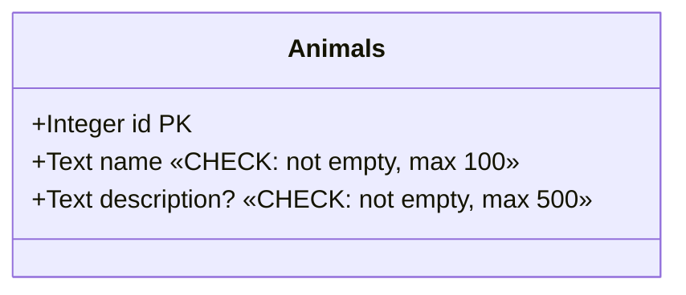
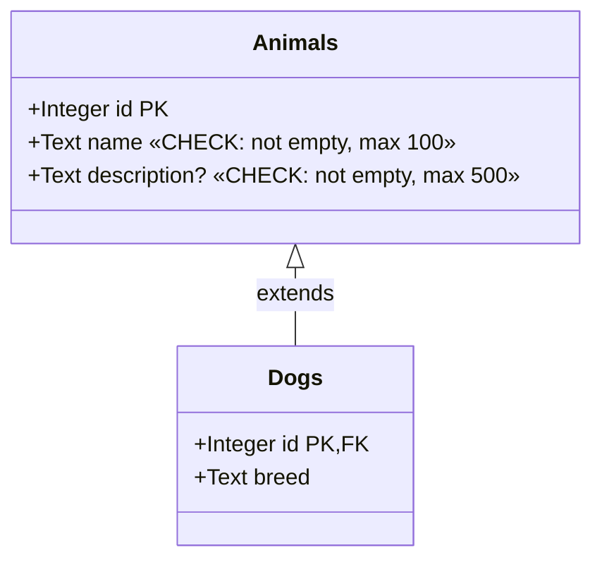
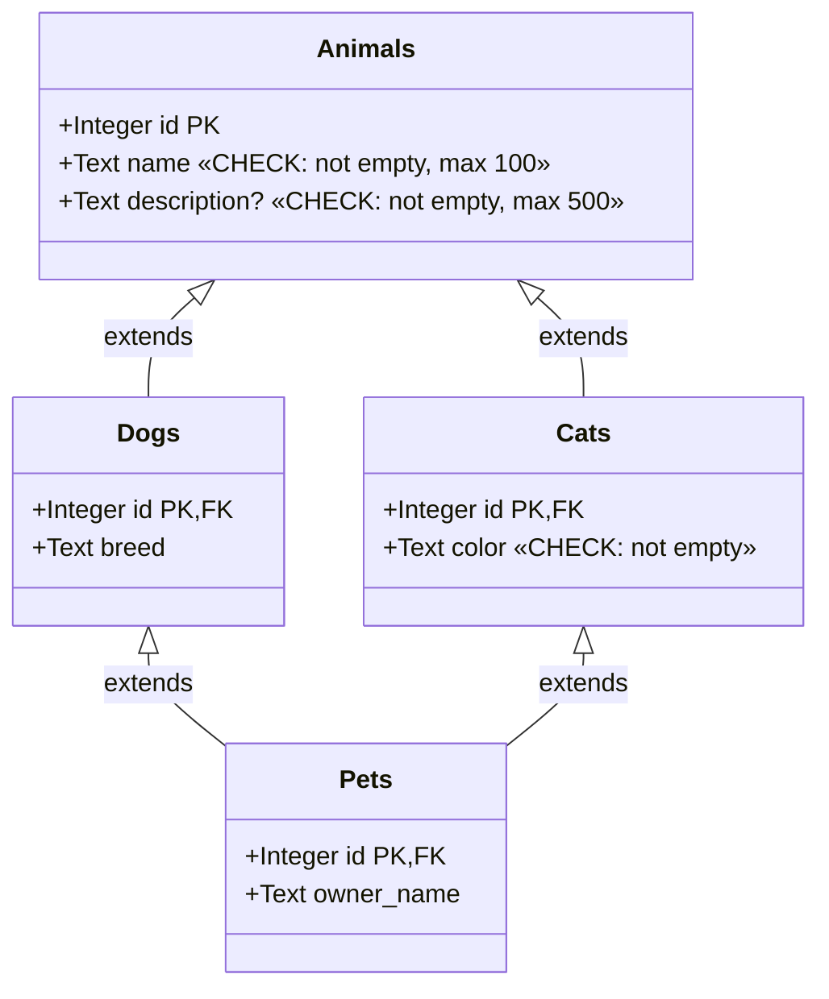
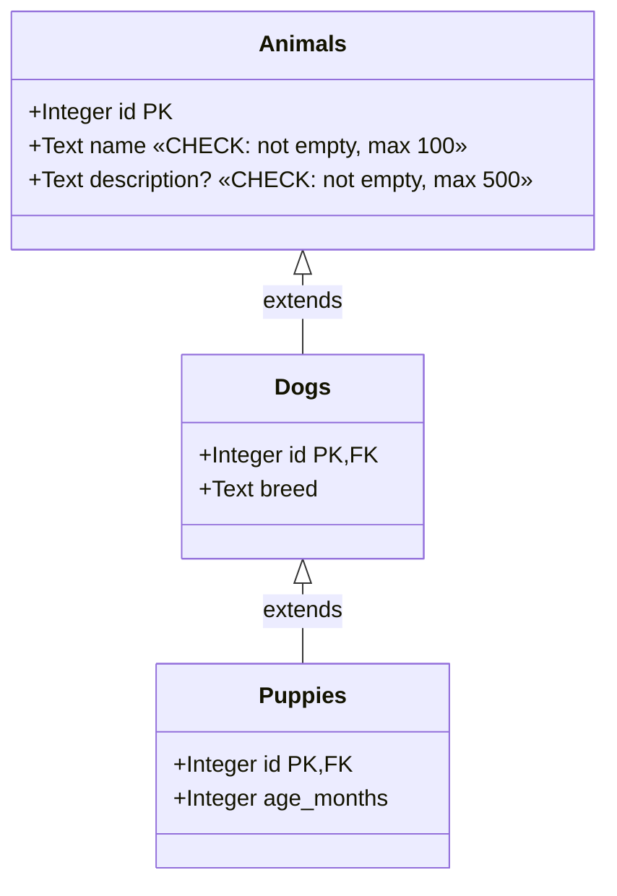
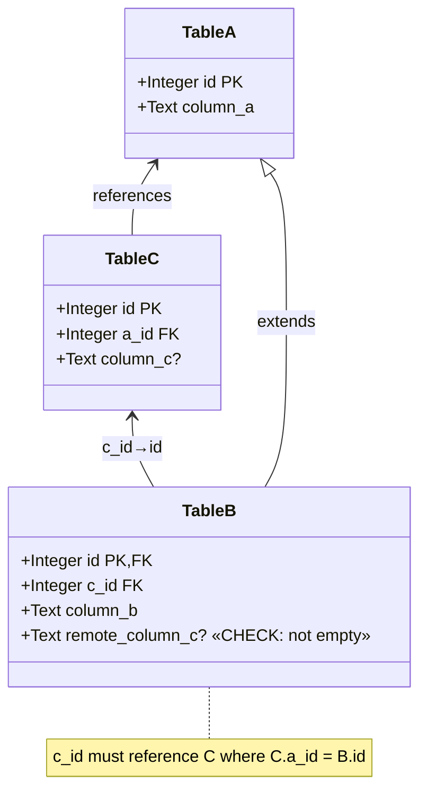
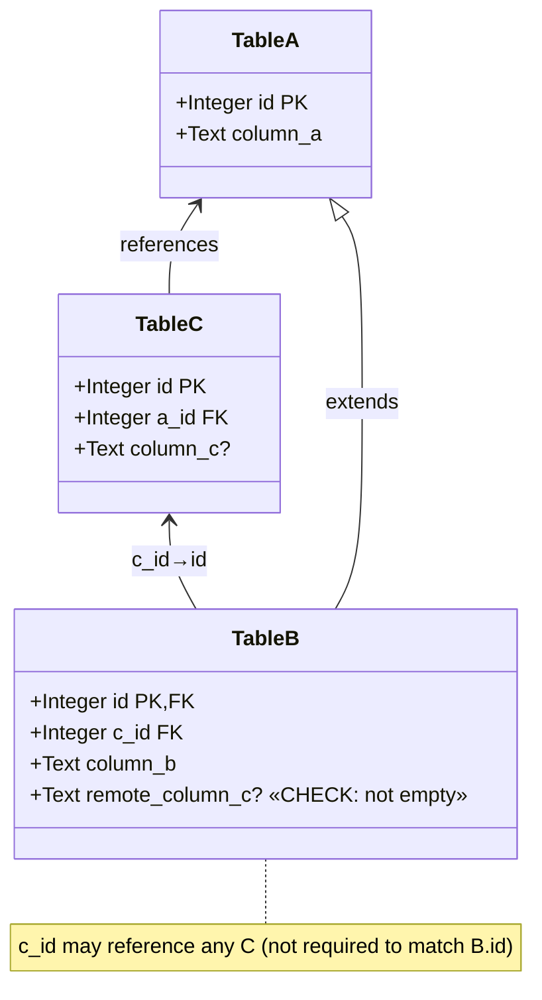
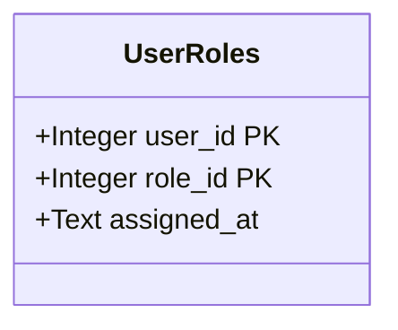

# Diesel Builders

[](https://github.com/LucaCappelletti94/diesel-builders/actions)
[](https://github.com/LucaCappelletti94/diesel-builders/actions)
[](https://codecov.io/gh/LucaCappelletti94)
[](https://opensource.org/licenses/MIT)

A type-safe builder pattern library for [Diesel](https://diesel.rs) that handles complex table relationships including arbitrary inheritance (e.g. chains, DAG dependencies), foreign keys, and both mandatory and optional triangular dependencies. Diesel Builders provides compile-time guarantees for proper insertion order and referential integrity in databases with complex schemas.

It additionally offers ergonomic APIs for getting/setting column values and associated builders and models, and [`serde`](https://github.com/serde-rs/serde) support.

This library is transparent in terms of backends and should work for any Diesel backend.

## Installation

Add this to your `Cargo.toml`:

```toml
[dependencies]
diesel-builders = {git = "https://github.com/LucaCappelletti94/diesel-builders.git", branch = "main" }
```

## Supported Patterns

### 1. Simple Table (Base Case)

[A single table with no relationships](diesel-builders/tests/test_base_case.rs). This demonstrates the most basic usage of the builder pattern with type-safe column setters. Optional validation through `TrySetColumn` trait implementations enables Rust-side check constraints that mirror [SQL CHECK CONSTRAINT](https://www.postgresql.org/docs/current/ddl-constraints.html), providing fail-fast validation before database insertion.



```rust,ignore
let animal = animals::table::builder()
    .try_name("Buddy")?
    .try_description("A friendly dog".to_owned())?
    .insert(&mut conn)?;
```

### 2. Table Inheritance

[Tables extending a parent table](diesel-builders/tests/test_inheritance.rs) via foreign key on the primary key. When inserting into a child table, the builder automatically creates the parent record and ensures proper referential integrity. The `#[descendant_of]` macro declares the inheritance relationship. Insertion order: Animals → Dogs.



```rust,ignore
let dog = dogs::table::builder()
    .try_name("Max")?
    .breed("Golden Retriever")
    .insert(&mut conn)?;
```

### 3. Directed Acyclic Graph (DAG)

[Multiple inheritance](diesel-builders/tests/test_dag.rs) where a child table extends multiple parent tables. Pets extends both Dogs and Cats, which both extend Animals. The builder automatically resolves the dependency graph and inserts records in the correct order, ensuring all foreign key constraints are satisfied. Insertion order: Animals → Dogs → Cats → Pets.



```rust,ignore
let pet = pets::table::builder()
    .try_name("Buddy")?  
    .breed("Labrador")
    .try_color("Black")?
    .owner_name("Alice Smith")
    .insert(&mut conn)?;
```

### 4. Inheritance Chain

[A linear inheritance chain](diesel-builders/tests/test_inheritance_chain.rs) where each table extends exactly one parent. Puppies extends Dogs, which extends Animals. The builder automatically determines and enforces the correct insertion order through the dependency graph. Insertion order: Animals → Dogs → Puppies.



```rust,ignore
let puppy = puppies::table::builder()
    .try_name("Buddy")?
    .breed("Labrador")
    .age_months(3)
    .insert(&mut conn)?;
```

### 5. Mandatory Triangular Relation

[A complex pattern](diesel-builders/tests/test_mandatory_triangular_relation.rs) where Table B extends A and also references Table C, with the constraint that the C record must also reference the same A record (enforcing `B.c_id == C.a_id == A.id`). The builder uses `set_mandatory_builder` to create both B and its related C record atomically, ensuring referential consistency. Foreign key relationships are declared using the `fk!` macro for type-safe multi-column constraints, with composite indices declared via `index!` macro (e.g., `index!((table_c::id, table_c::a_id));`). Insertion order: A → C → B.



```rust,ignore
let b = table_b::table::builder()
    .column_a("Value A for B")
    .column_b("Value B")
    .c_id_builder(table_c::table::builder().column_c("Value C".to_owned()))
    .insert(&mut conn)?;
```

### 6. Discretionary Triangular Relation

[Similar to the mandatory triangular relation](diesel-builders/tests/test_discretionary_triangular_relation.rs), but the constraint is relaxed. Table B can reference any C record, not necessarily one that shares the same A parent. The builder provides `set_discretionary_builder` for creating new related records or `set_discretionary_model` for referencing existing ones. Foreign key relationships are declared using the `fk!` macro, with composite indices declared via `index!` macro where needed. Insertion order: A → C (independent) → B (where B references the independent C).



```rust,ignore
let b = table_b::table::builder()
    .column_a("Value A for B")
    .column_b("Value B")
    .c_id_builder(table_c::table::builder().column_c("Value C".to_owned()))
    .insert(&mut conn)?;
```

```rust,ignore
let c = table_c::table::builder()
    .a_id(a.id)
    .column_c("Value C".to_owned())
    .insert(&mut conn)?;

let b = table_b::table::builder()
    .column_a("Value A for B")
    .column_b("Value B")
    .c_id_model(&c)
    .insert(&mut conn)?;
```

### 7. Composite Primary Keys

[Tables with multi-column primary keys](examples/composite_primary_keys.rs) are fully supported. The builder pattern works seamlessly with composite keys, allowing type-safe construction and insertion.



## Helper Method Traits

The `TableModel` derive automatically generates helper traits for each column, providing a fluent API for models and builders. For a column like `animals::name`, it generates:

- **`GetAnimalsName`** trait with methods:
  - `name(&self)` - returns `&Type` for the column value

- **`SetAnimalsName`** trait with methods:
  - `name(self, value)` - consumes and returns self
  - `name_ref(&mut self, value)` - mutates self by reference

- **`TrySetAnimalsName`** trait with fallible methods:
  - `try_name(self, value) -> Result<Self, Error>` - consumes and returns Result
  - `try_name_ref(&mut self, value) -> Result<&mut Self, Error>` - mutates by reference

These traits are automatically implemented for any type that implements `GetColumn<column>`, `SetColumn<column>`, or `TrySetColumn<column>`.

### Triangular Relation Traits

For columns involved in triangular relations (both mandatory and discretionary), additional builder and model setter traits are generated:

- **Mandatory Builders**: `Set{Table}{Column}MandatoryBuilder` and `TrySet{Table}{Column}MandatoryBuilder`
  - `{column}_builder(self, builder) -> Self` - sets associated builder (consumes)
  - `{column}_builder_ref(&mut self, builder) -> &mut Self` - sets associated builder (by reference)
  - `try_{column}_builder(self, builder) -> Result<Self, Error>` - fallible variant

- **Discretionary Builders**: `Set{Table}{Column}DiscretionaryBuilder` and `TrySet{Table}{Column}DiscretionaryBuilder`
  - `{column}_builder(self, builder) -> Self` - sets associated builder (consumes)
  - `{column}_builder_ref(&mut self, builder) -> &mut Self` - sets associated builder (by reference)
  - `try_{column}_builder(self, builder) -> Result<Self, Error>` - fallible variant

- **Discretionary Models**: `Set{Table}{Column}DiscretionaryModel` and `TrySet{Table}{Column}DiscretionaryModel`
  - `{column}_model(self, &model) -> Self` - references existing model (consumes)
  - `{column}_model_ref(&mut self, &model) -> &mut Self` - references existing model (by reference)
  - `try_{column}_model(self, &model) -> Result<Self, Error>` - fallible variant

Usage examples:

```rust,ignore
// Basic column setter
let animal: Animal = animals::table::builder()
    .try_name("Buddy")?
    .insert(conn)?;

assert_eq!(animal.name(), "Buddy");

// Mandatory triangular relation with builder
let b = table_b::table::builder()
    .column_b("B Value")
    .try_c_id_builder(table_c::table::builder().column_c("C Value".to_owned()))?
    .insert(conn)?;

// Discretionary triangular relation with existing model
let c = table_c::table::builder()
    .a_id(a.id)
    .column_c("C Value".to_owned())
    .insert(conn)?;

let b = table_b::table::builder()
    .column_b("B Value")
    .c_id_model(&c)  // Reference existing model
    .insert(conn)?;
```

## Performance

Compile times by tuple size (using `cargo clean && time cargo build --features size-{tuple_size}`):

| Max Tuple Size | Compile Time |
|----------------|--------------|
| 8 (default)    | ~9s         |
| 16             | ~10s         |
| 32             | ~13s         |
| 48             | ~21s         |
| 64             | ~38s         |
| 96             | ~118s        |

## License

MIT

## Contributing

Contributions are welcome! Please feel free to submit a Pull Request.
