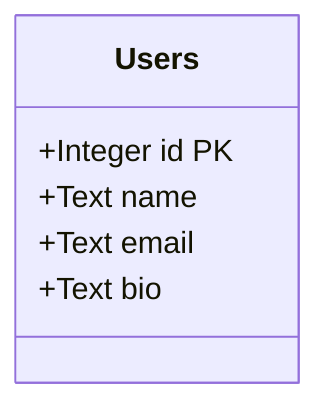
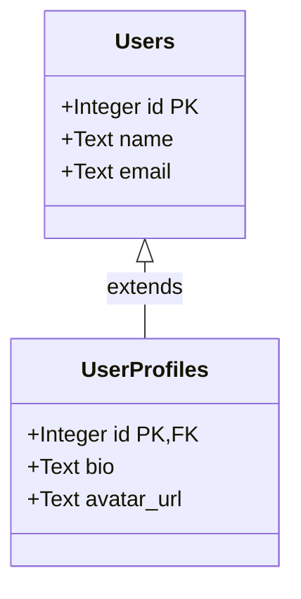
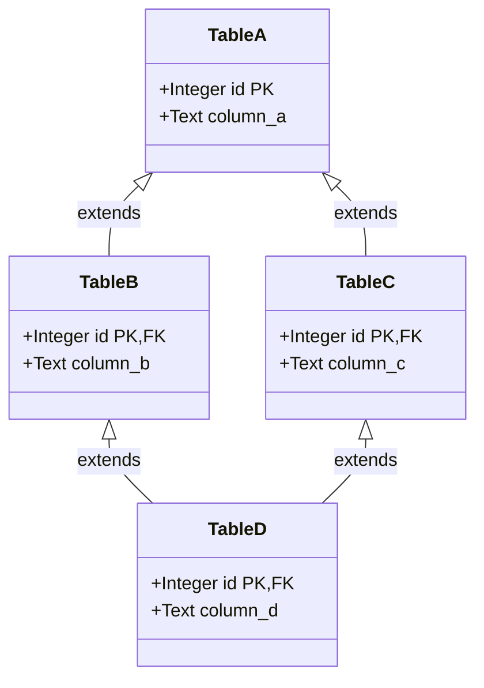
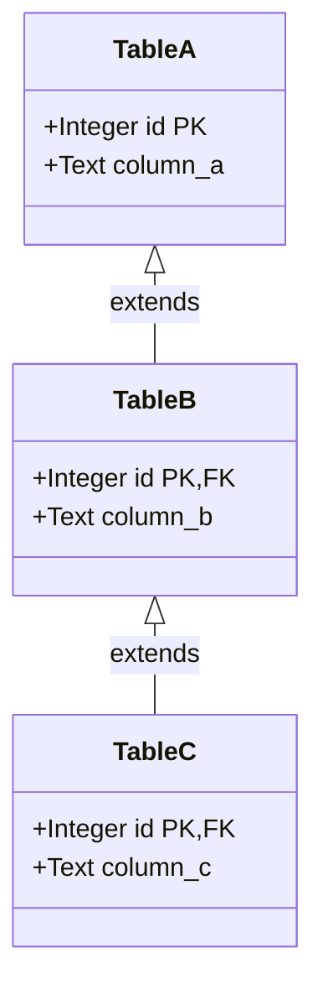
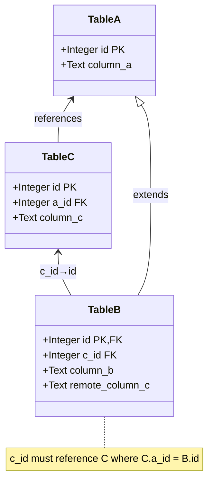
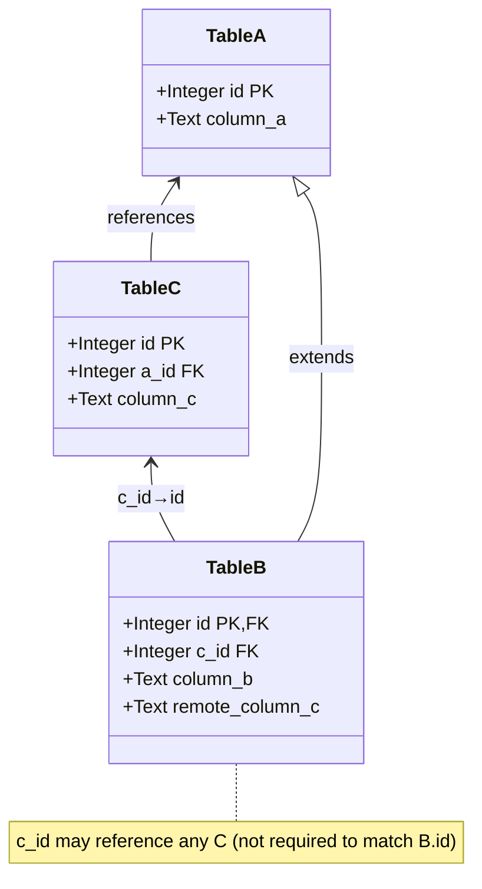
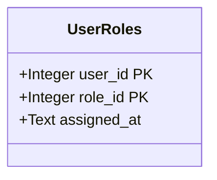

# Diesel Builders

[](https://docs.rs/diesel-builders)
[](https://github.com/LucaCappelletti94/diesel-builders/actions)
[](https://github.com/LucaCappelletti94/diesel-builders/actions)
[](https://codecov.io/gh/LucaCappelletti94)
[](https://opensource.org/licenses/MIT)
[](https://crates.io/crates/diesel-builders)

A type-safe builder pattern library for [Diesel](https://diesel.rs) that handles complex table relationships including arbitrary inheritance (including DAG dependencies), foreign keys, and both mandatory and optional triangular dependencies. Diesel Builders provides compile-time guarantees for proper insertion order and referential integrity in databases with complex schemas.

It additionally offers ergonomic APIs for getting/setting column values and associated builders and models.

## Installation

Add this to your `Cargo.toml`:

```toml
[dependencies]
diesel-builders = "0.1"
```

## Supported Patterns

### 1. Simple Table (Base Case)

A single table with no relationships. This demonstrates the most basic usage of the builder pattern with type-safe column setters and optional validation through `TrySetColumn` trait implementations.



See the [simple_table.rs example](examples/simple_table.rs) for a complete working implementation including SQL CHECK constraints.

### 2. Table Inheritance

Tables extending a parent table via foreign key on the primary key. When inserting into a child table, the builder automatically creates the parent record and ensures proper referential integrity. The `#[descendant_of]` macro declares the inheritance relationship.



See the [table_inheritance.rs example](examples/table_inheritance.rs) for a complete working implementation.

### 3. Directed Acyclic Graph (DAG)

Multiple inheritance where a child table extends multiple parent tables. Table D extends both B and C, which both extend A. The builder automatically resolves the dependency graph and inserts records in the correct order (A → B, C → D), ensuring all foreign key constraints are satisfied.



See the [dag.rs example](examples/dag.rs) for a complete working implementation.

### 4. Inheritance Chain

A linear inheritance chain where each table extends exactly one parent (A → B → C). The builder automatically determines and enforces the correct insertion order through the dependency graph.



See the [inheritance_chain.rs example](examples/inheritance_chain.rs) for a complete working implementation.

### 5. Mandatory Triangular Relation

A complex pattern where Table B extends A and also references Table C, with the constraint that the C record must also reference the same A record (enforcing `B.c_id == C.a_id == A.id`). The builder uses `set_mandatory_builder` to create both B and its related C record atomically, ensuring referential consistency.



See the test suite (`tests/test_mandatory_triangular_relation.rs`) for a complete working implementation.

### 6. Discretionary Triangular Relation

Similar to the mandatory triangular relation, but the constraint is relaxed—Table B can reference any C record, not necessarily one that shares the same A parent. The builder provides `set_discretionary_builder` for creating new related records or `set_discretionary_model` for referencing existing ones.



See the test suite at [test_discretionary_triangular_relation.rs](diesel-builders/tests/test_discretionary_triangular_relation.rs) for complete working examples.

### 7. Composite Primary Keys

Tables with multi-column primary keys are fully supported. The builder pattern works seamlessly with composite keys, allowing type-safe construction and insertion.



See the [composite_primary_keys.rs example](examples/composite_primary_keys.rs) for a complete working example.

## Macro Attributes

- `#[derive(Root)]`: Marks a table as a root (no parent tables)
- `#[derive(TableModel)]`: Generates model-to-table associations
- `#[derive(GetColumn, SetColumn)]`: Generates type-safe column accessors
- `#[descendant_of]`: Declares parent table relationships
- `#[bundlable_table]`: Configures triangular relationship columns

## License

MIT

## Contributing

Contributions are welcome! Please feel free to submit a Pull Request.
